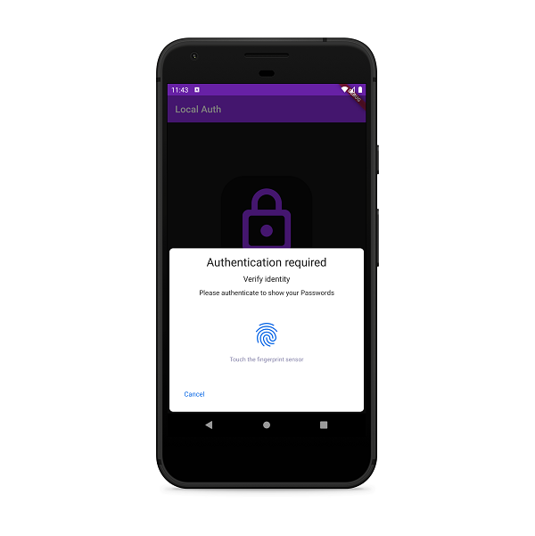
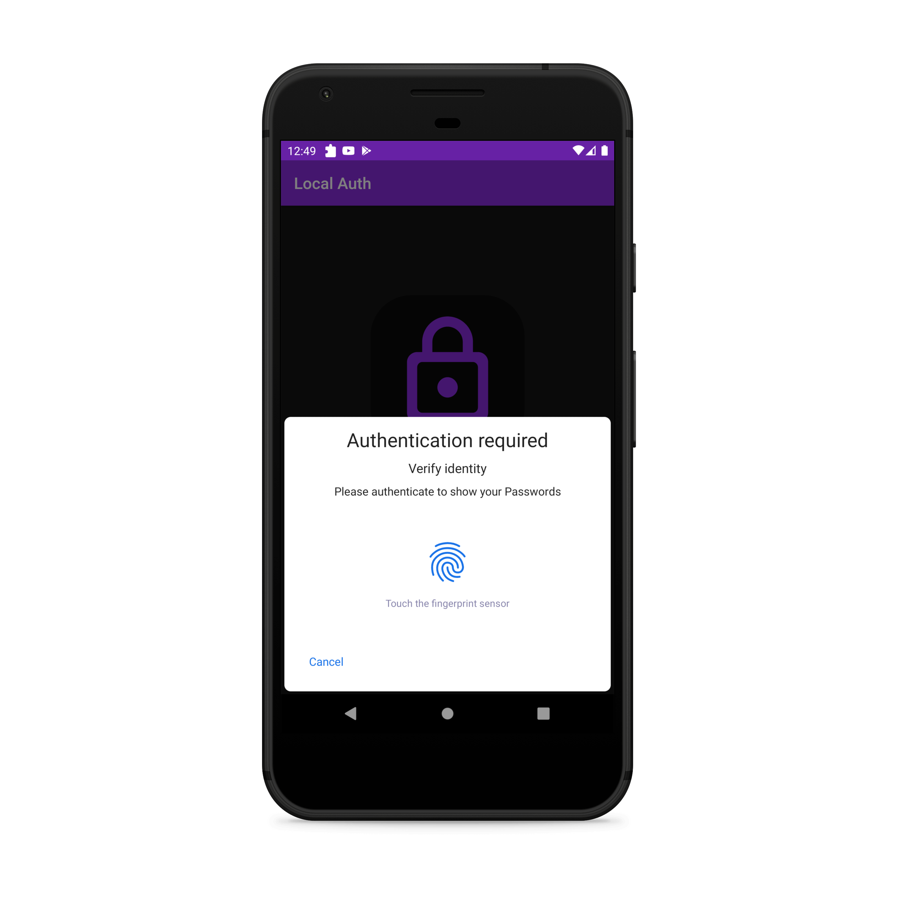
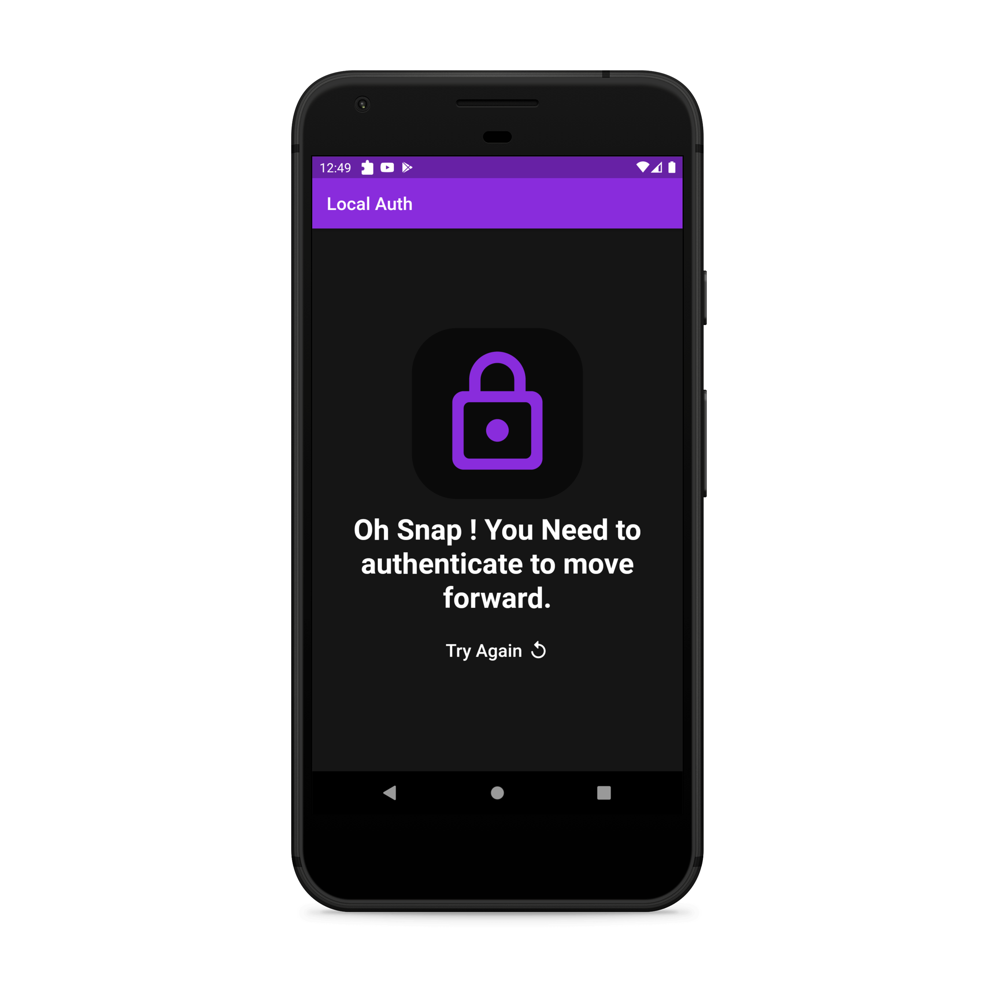
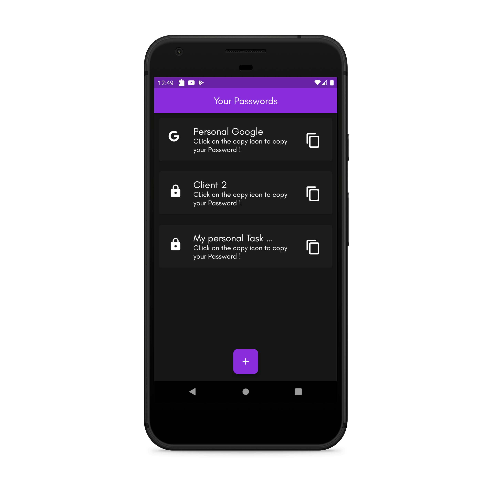
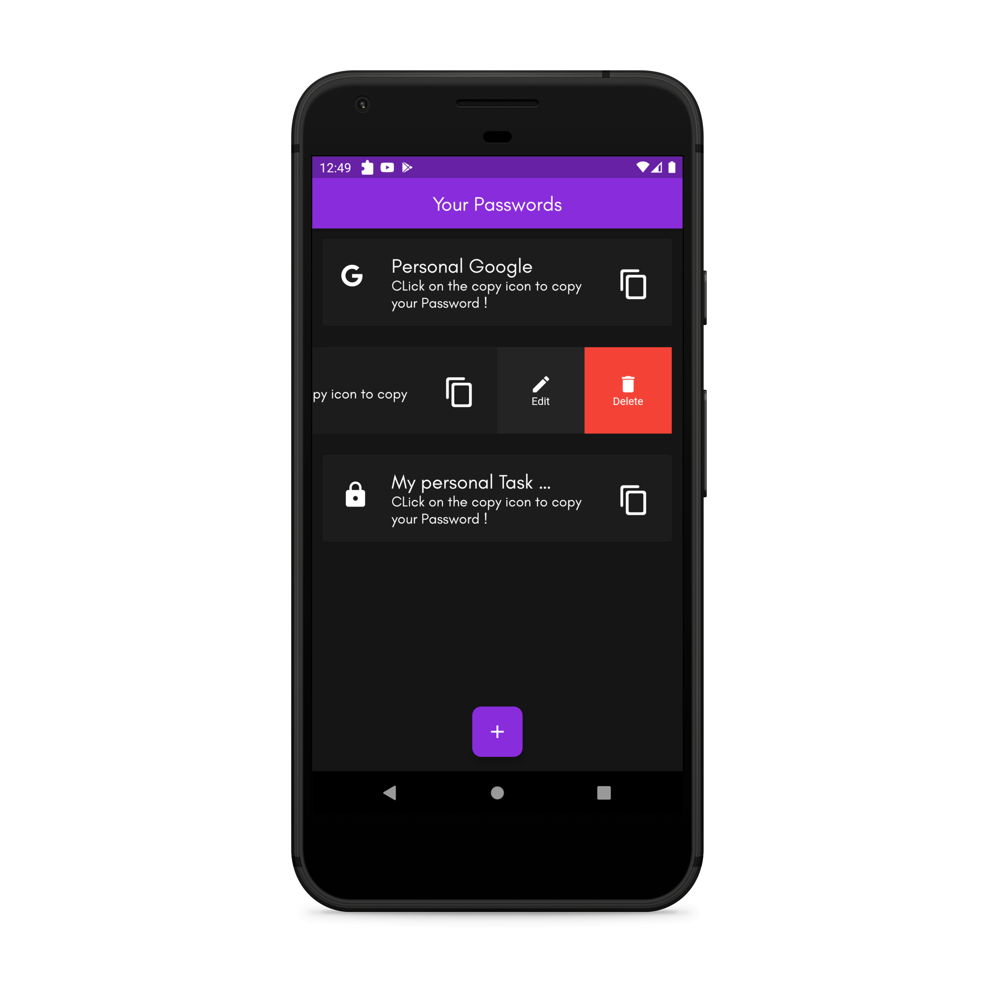
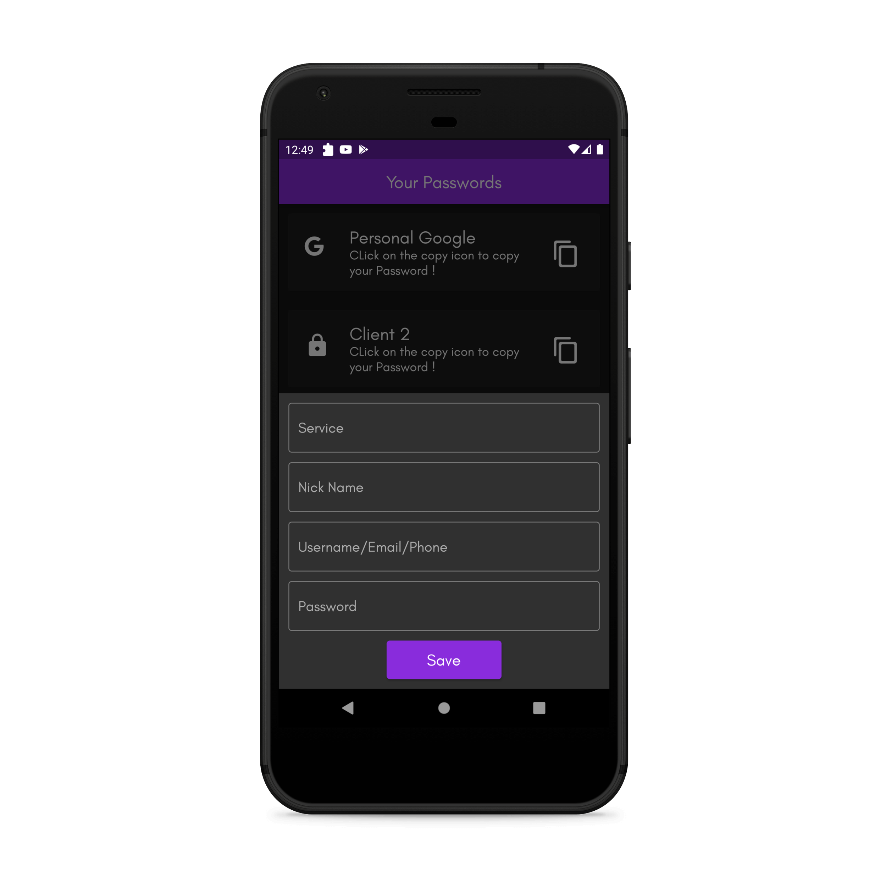
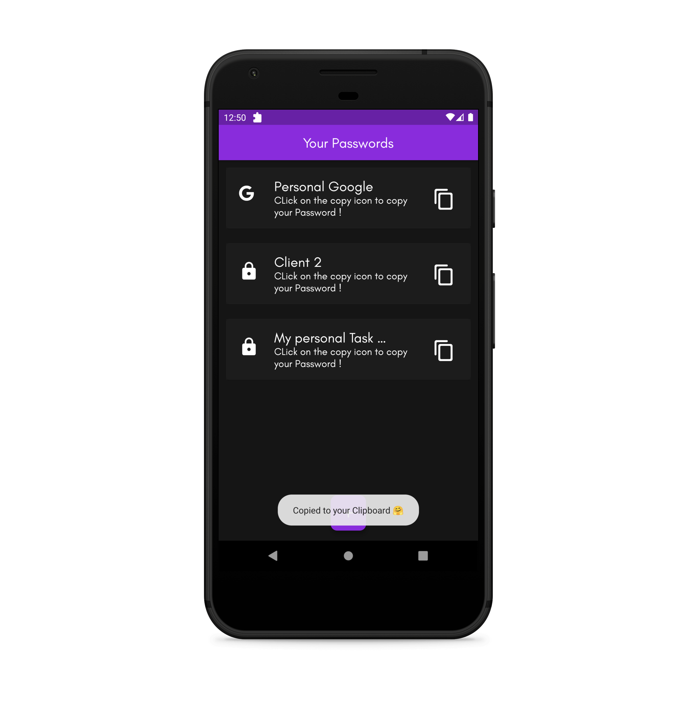

# Flutter Password Manager

## TODO

- [ ] Fix UI inconsistency. 

- [ ] Add Null Safety

- [ ] Push Code to another branch and add maaster/main branch with Model and Provider.

 A Password manager coded entirely in Flutter that used Three layers of security. It saves password in your Phone's local Storage, thus no issue of data Leak from a server. 

    - Support Local Storage Only as of now
    - Not for web
    - You can easily add Custom Backend

# Security Layers
    1. Your password String is Encrypted itself.
    2. The Entire Database is encrypted.
    3. Uses Your Phone's Local Bio (Fingerprint) auth.
        - Also it is single-time Allow only, 
        which means if you press home or back, You will have to re-authenticate.

# Security 
    - need to re-authenticate every time app is launched
    - Won't be visible in recent - activity
    - Local Authentication ( Bio )
    - Database is encrypted
    - Passwords are encrypted
    - App Level security

# Todos
    - add Delete
    - add Edit
    - add a text-auto-fill for correctly mapping icons to service

# Screenshots

  
## SOCIAL

[Facebook 🧡](https://www.facebook.com/desiprogrammerofficial)

[Instagram](https://www.instagram.com/desiprogrammer/)

[Gitlab](https://gitlab.com/desiprogrammer)

[Github](https://github.com/desi-programmer)

  
# Data
    - type
    - nick
    - username/email
    - password